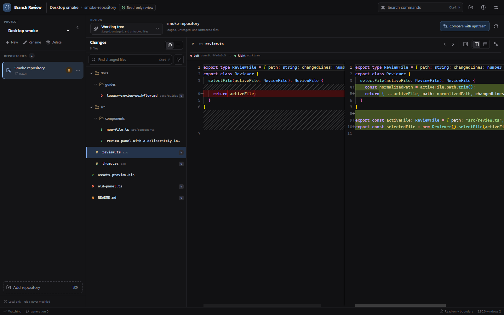

# Branch Review

Branch Review is a Windows desktop application for reviewing branches and working-tree changes across multiple Git repositories. Its comparison and audit-capture paths are read-only; an explicitly started remediation agent can edit ordinary workspace files under a repository-scoped sandbox. The repository also contains the reusable `github_diff` Rust backend. Git inspection uses a closed set of read-only commands and never checks out branches or mutates Git references.

The finished desktop application lives in [`app/`](app/README.md). Its Tauri 2 shell owns one long-lived backend, while the React renderer provides a dense three-pane review workspace, saved projects, live watcher refresh, virtualized changed files, and lazy Monaco split/unified diffs.



## Included

- Multiple repositories open concurrently, each with its own opaque `RepoId` and generation.
- Ordinary repositories, nested input paths, linked worktrees, detached HEAD, unborn HEAD, shallow repositories, and SHA-1/SHA-256 object IDs.
- Local and remote branch discovery through opaque `RefId` values.
- Direct, since-merge-base, unstaged, staged, and all-uncommitted comparisons.
- Porcelain-v2 status parsing for staged, unstaged, untracked, renamed/copied, conflicted, and submodule records.
- On-demand file sides through opaque `ComparisonId`/`FileId` mappings.
- Typed text, binary, too-large, missing, symlink, submodule, and unsupported-encoding content.
- Bounded/cancellable Git subprocesses and file reads, environment isolation, no shell invocation, and stale-generation checks.
- Debounced filesystem invalidation plus manual refresh.
- A thin `Backend` adapter ready to wrap with Tauri commands.

## Use

### Desktop application

Requirements: Rust stable, Git, Node.js, and pnpm 11.9.0.

```text
cd app
pnpm install
pnpm tauri dev
```

Create Windows installers with:

```text
cd app
pnpm tauri build
```

### Rust library

```rust,no_run
use github_diff::{ComparisonRequest, RepositoryRegistry};

# async fn example() -> github_diff::Result<()> {
let backend = RepositoryRegistry::system();
let snapshot = backend.open_repository("C:/work/project").await?;
let left = snapshot.references[0].id.clone();
let right = snapshot.references[1].id.clone();
let result = backend
    .create_comparison(&snapshot.repo_id, ComparisonRequest::Direct { left, right })
    .await?;
if let Some(file) = result.files.first() {
    let sides = backend
        .get_file_comparison(&snapshot.repo_id, &result.comparison_id, &file.file_id)
        .await?;
    println!("{}", sides.file_id.0);
}
# Ok(())
# }
```

All repository-derived responses carry a repository generation. Frontends should reject responses older than their latest generation and should never persist runtime IDs or comparison/file content as project configuration.

## Verification

```text
cd app
pnpm check:local
pnpm check:full
```

`check:local` is the fast pre-push gate: TypeScript contracts, lint, renderer
tests, the Rust workspace tests, and the Tauri command-layer tests.
`check:full` adds mocked end-to-end tests and a real Windows
Tauri/WebView2 smoke run.

The integration suites create real temporary Git repositories and cover branch semantics, worktrees, unrelated histories, staged/unstaged/untracked changes, conflicts, binary/large files, symlinks, unusual filenames, opaque-ID injection resistance, bare rejection, detached/unborn HEAD, closure, parallel repositories, mocked renderer workflows, and a real Windows Tauri/WebView2 smoke run.
